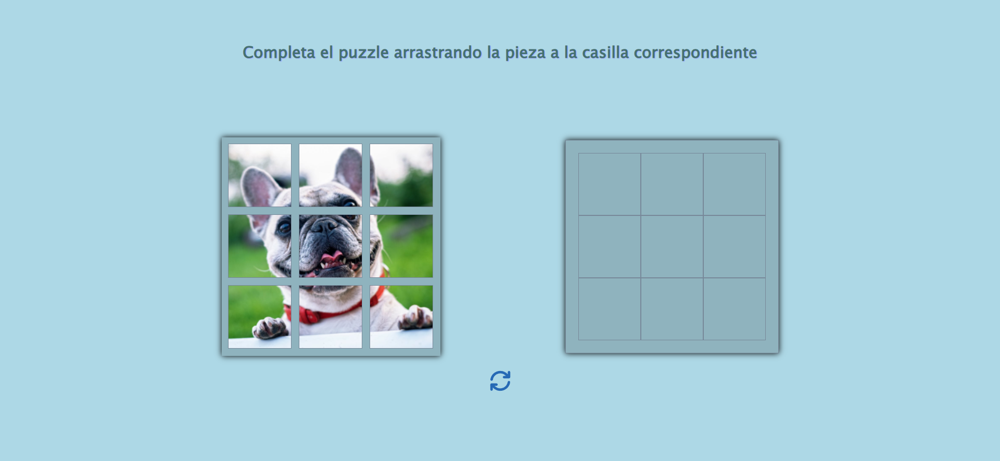

# Juego de puzzle sencillo

Juego interactivo que consiste en completar un sencillo puzzle realizado en:

- HTML
- CSS Vanilla
- JS Vanilla

Para mover las piezas del puzzle se ha usado *drag and drop* en JS y *draggable = true* en el elemento a mover en HTML

Aquí puedes ver cómo quedaría:

